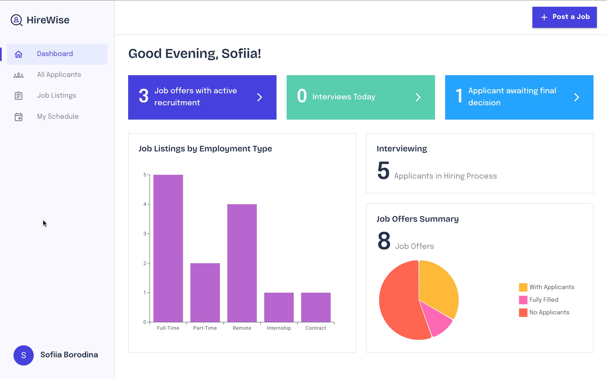
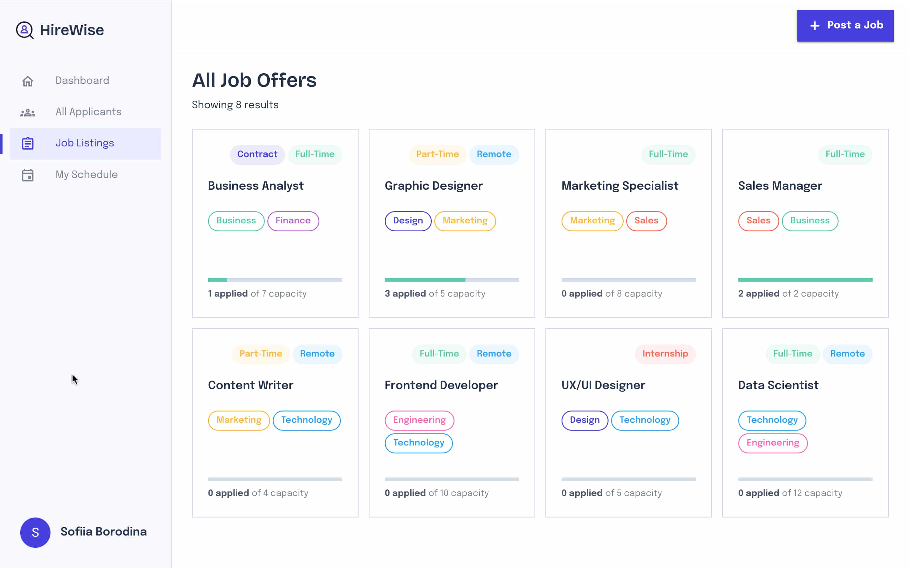
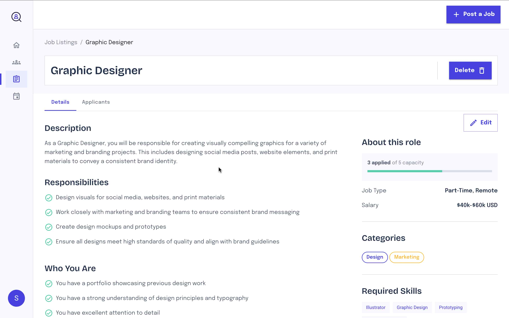
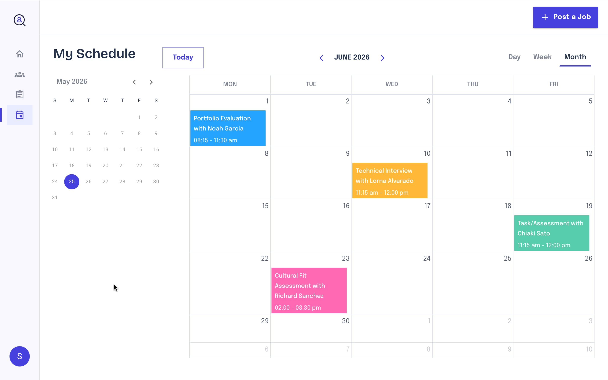
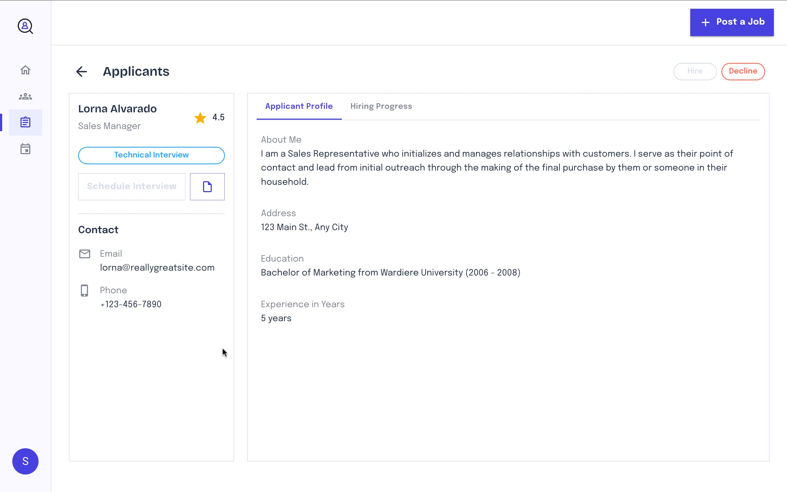
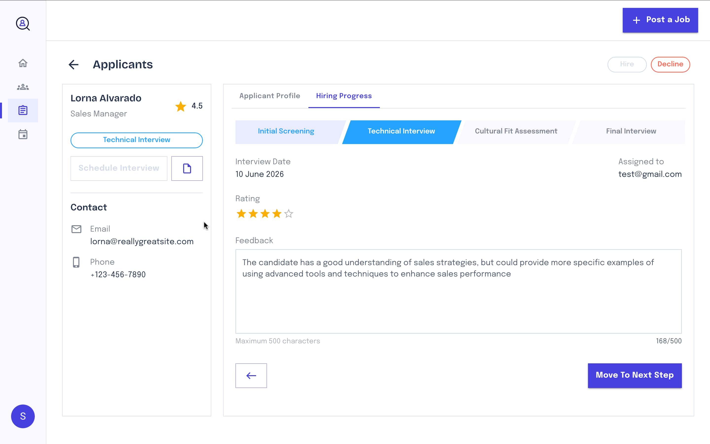
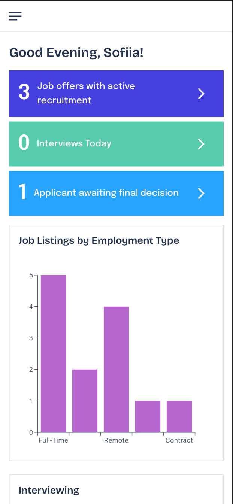

# 🧑‍💻 HireWise - AI-Powered Recruitment Management Platform

> **Hiring, simplified from first application to final decision.** HireWise helps teams create job openings, review applicants, schedule interviews, and track candidates through every stage - with AI-powered resume parsing that turns uploaded files into structured profiles automatically.

👉 [Watch the live demo](https://www.loom.com/share/e274d458e7c7452abfb63441c0fb6fc4)

---

## UI Overview

### Dashboard

> Personalized home screen with at-a-glance recruitment stats - active job offers, interviews today, and applicants awaiting a final decision - alongside a bar chart of listings by employment type and a pie chart of job offer status.



---

### Job Listings

> A card-based grid of all open roles, each showing employment type, category tags, and an applicant-to-capacity progress bar at a glance.



---

### Job Detail

> Full job description view with responsibilities, requirements, salary, required skills, and a live applicant count - with a tabbed Applicants panel alongside.



---

### Interview Schedule

> A monthly calendar view of all scheduled interviews with day/week/month toggle and a mini-calendar for quick navigation.



---

### Applicant Profile

> Structured candidate view showing contact details, education, experience, and an About Me section - auto-populated from AI-parsed resume data.



---

### Hiring Progress

> Stage-by-stage pipeline tracker with per-stage interview date, assignee, star rating, and a feedback field - with a Move to Next Step action.



---

### Mobile Experience

> The dashboard stats, charts, and navigation all reflow cleanly for smaller screens.



---

## Features

- **AI-powered resume parsing** — Upload a PDF resume and OpenAI automatically extracts key information into a structured applicant profile, with hiring stages and status pre-assigned
- **End-to-end hiring pipeline** — Step-by-step job creation, custom multi-stage recruitment templates, stakeholder assignment, and full offer lifecycle management
- **Applicant lifecycle management** — resume previews, profile details, stage progression, interview feedback, star ratings, hiring decisions, rejection reasons, and candidate removal
- **Interview scheduling & calendar** — Role-aware scheduling permissions, monthly/weekly/daily views, and full meeting detail coordination
- **Analytical dashboard** — Visual hiring metrics including applicant trends, job offer performance breakdowns, and real-time recruitment insights
- **Secure authentication** — Seamless sign-up, sign-in, and persistent user sessions via Firebase Auth
- **Real-time synchronization** — Firestore-powered live updates with efficient RTK Query caching across candidate stages, interview events, and dashboard data

---

## Tech Stack

| Category                 | Technologies                                                         |
| ------------------------ | -------------------------------------------------------------------- |
| **Core**                 | React, Vite, TypeScript                                              |
| **AI & File Processing** | OpenAI API, pdfjs-dist, Lodash Debounce                              |
| **State Management**     | Redux, Redux Toolkit, RTK Query                                      |
| **Routing**              | React Router DOM                                                     |
| **Styling**              | Material UI (MUI)                                                    |
| **Forms & Validation**   | React Hook Form, Zod                                                 |
| **Backend & Cloud**      | Firebase Cloud Functions, Firebase Auth, Firestore, Firebase Storage |
| **Deployment & CI/CD**   | Firebase Hosting, GitHub Actions                                     |
| **Code Quality**         | ESLint, Prettier                                                     |

---

## Project Structure

```
src/
├── app/                  # Application-wide infrastructure — config, shared hooks, services, Redux store
└── features/             # Domain-based feature modules
    ├── applicant/        # Applicant profiles, CV parsing, stage management, hiring decisions
    ├── auth/             # Sign-up, sign-in, and persistent session handling
    ├── calendar/         # Interview scheduling, calendar views, and meeting coordination
    ├── dashboard/        # Recruitment analytics, charts, and hiring metrics
    ├── home/             # Landing and entry point experience
    ├── job/              # Job creation, listings, detail views, and offer lifecycle
    └── ui/               # Shared feature-level UI components
```

---

## Getting Started

### Prerequisites

- Node.js ≥ 18
- Yarn
- A Firebase project ([create one here](https://console.firebase.google.com/))
- An OpenAI API key ([get one here](https://platform.openai.com/api-keys))

### 1. Clone the repository

```bash
git clone https://github.com/borodinka/hire-wise.git
cd hire-wise
```

### 2. Install dependencies

```bash
yarn
```

### 3. Configure environment variables

Create a `.env` file in the project root:

```env
VITE_FIREBASE_API_KEY=your_api_key
VITE_FIREBASE_AUTH_DOMAIN=your_auth_domain
VITE_FIREBASE_PROJECT_ID=your_project_id
VITE_FIREBASE_STORAGE_BUCKET=your_storage_bucket
VITE_FIREBASE_MESSAGING_SENDER_ID=your_messaging_sender_id
VITE_FIREBASE_APP_ID=your_app_id
VITE_OPENAI_API_KEY=your_openai_key
```

> Firebase credentials can be found under **Project Settings → General → Your apps** in the Firebase Console.

### 4. Start the development server

```bash
yarn dev
```

The app will be available at **http://localhost:5173**
